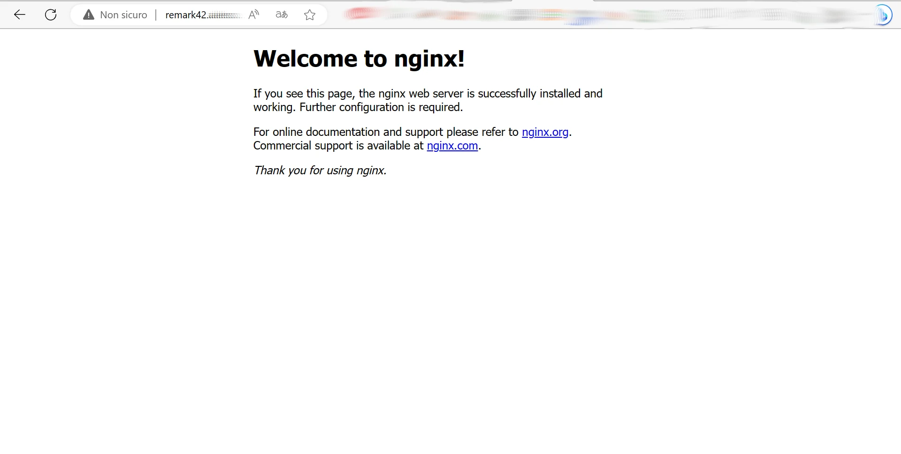

Source: [Dev Bits and Bytes](https://www.devbitsandbytes.com/setting-up-remark42-from-scratch/){:target="_blank"}.

Since the beginning this personal website was thought also as a learning experience. I'm having the opportunity to work with many different technologies I barely knew before, while making a lot of mistakes without any consequence.

In this first post you'll follow my journey setting up the [Remark42](https://remark42.com/){:target="_blank"} comment engine, which took a bit of time and effort, mainly for my inexperience.

- [1. Why Remark42?](#1-why-remark42)
- [2. Choosing the server](#2-choosing-the-server)
- [3. Installing Remark42 on the server](#3-installing-remark42-on-the-server)
- [4. Let a subdomain point the server's IP](#4-let-a-subdomain-point-the-servers-ip)
- [5. Setup nginx for proxying the connection](#5-setup-nginx-for-proxying-the-connection)
- [6. Adding the widget to your website](#6-adding-the-widget-to-your-website)


## 1. Why Remark42?

There are many services that offer a commenting system to embed in a static website, including the super popular Disqus, which was also built-in with the theme I'm using. However, Disqus was never an option for me, due to its low performances and issues with [privacy and ads](https://www.google.com/url?sa=t&rct=j&q=&esrc=s&source=web&cd=&cad=rja&uact=8&ved=2ahUKEwixmauM9cWAAxUKVUEAHSsSAAIQFnoECBgQAQ&url=https%3A%2F%2Ffatfrogmedia.com%2Fdelete-disqus-comments-wordpress%2F&usg=AOvVaw2X620F0VNj8S2h7wtZCERP&opi=89978449){:target="_blank"}.

I considered different options, like Staticman, Utterances, Commento, Remarkbox or Isso. All of them are perfectly functional and privacy concerned services, but Remark42 seemed to offer the most complete package; I liked particularly the **wide range of authentication services**, thanks to its support of Auth0.

The price to pay is sacrificing the static nature of your website, since a server is needed to host the backend (and this could be an actual *price*).

## 2. Choosing the server

As previously mentioned, choosing a server is vital for Remark42. A doable option could be setting up an old laptop or a Raspberry Pi to host the code, but in my case I didn't have a reliable connection at my parents' house and, since I'm moving a lot, solving any connection issue could have been an hassle.

So, I opted for a **cloud server**, more specifically a VPS (Virtual Private Server). At first, the idea was using a free service.

In particular, the first choice was [Oracle Cloud free tier](https://signup.cloud.oracle.com/){:target="_blank"}, which is appreciated by many people and offers a good package for the 0€ price. However I tried 4 times to sign-up and was rejected all of them for one of the following reasons:
- A. Using prepaid cards (actually, I used a debit card, which should be accepted);
- B. Intentionally or unintentionally masking my location or identity (okay, maybe being an Italian who lives in Ireland doesn't help);
- C. Entering incomplete or inaccurate account details.

So, I gave up.

The next option could have been Google Cloud, which offers a [free tier](https://cloud.google.com/free/docs/free-cloud-features?hl=en#free-tier-usage-limits){:target="_blank"} for its Compute Engine VPS. However, since it's a cloud provider, all the resources scale autonomously and if for any reason the website's traffic explodes, I could have some unexpected costs.

Then, another interesting cloud provider was [Render.com](render.com){:target="_blank"}, which has an actual free tier without unexpected costs and promised to run Docker containers. However, their "Web Services" must be built from a Dockerfile and not a `docker-compose.yml`, like Remark42. There is a way to avoid this limitation by doing some conversions, but I was too tired to investigate further.

In the end, I decided to sign up for a paid VPS and looked for the cheapest one. After some research, I chose [RackNerd](https://www.racknerd.com/){:target="_blank"}, which had a 4th July offer that may still be available, check the [link](https://my.racknerd.com/index.php?rp=/store/4th-of-july-2023){:target="_blank"}. I paid and will pay 11.38$/year forever (excluding VAT) for a more than decent VPS.

## 3. Installing Remark42 on the server

I followed the [official procedure](https://remark42.com/docs/getting-started/installation/) and started from the `docker-compose.yml` file you can find on the Remark42 repository.

There, I added all the **parameters** needed for my use. At first, I enabled authenticating with Telegram, GitHub, Google and Anonymously following [these indications](https://remark42.com/docs/configuration/authorization/). Then, I also enabled email authentication following [these other indications](https://remark42.com/docs/configuration/email/) for Gmail. Moreover, I enabled [Slack admin notifications](https://remark42.com/docs/configuration/notifications/).

In the end, the file looked like this (I've hidden all the sensitive fields and changed the domain):
```yml
version: "2"

services:
  remark:
    build: .
    image: umputun/remark42:latest
    container_name: "remark42"
    hostname: "remark42"
    restart: always

    logging:
      driver: json-file
      options:
        max-size: "10m"
        max-file: "5"

    # uncomment to expose directly (no proxy)
    ports:
    #  - "80:8080"
    #  - "443:8443"
      - 8080:8080

    environment:
      - REMARK_URL=https://remark42.yourdomain.com
      - SECRET=                   # You must set the secret. It seems that the server password should match it, but I'm not 100% sure
      - SITE=remark42.yourdomain  # Choose whatever name you like, it'll be used to implement Remark42 on the Frontend
      - DEBUG=true
      - ADMIN_SHARED_EMAIL=       # For sending notifications and confirmation to users
      - EMOJI=                    # Everybody likes emoji
      - NOTIFY_ADMINS=slack
      - NOTIFY_SLACK_CHAN=general
      - NOTIFY_SLACK_TOKEN=       # Your Slack token here
      - SMTP_HOST=smtp.gmail.com
      - SMTP_PORT=465
      - SMTP_TLS=true
      - SMTP_USERNAME=            # Your Gmail login address here
      - SMTP_PASSWORD=            # Your Gmail application password here (if 2FA is enabled)
      - AUTH_EMAIL_FROM=          # The sending address, it can also be an alias
      - NOTIFY_EMAIL_FROM=        # Same as above
      - AUTH_EMAIL_ENABLE=true
      - AUTH_ANON=true
      - AUTH_GOOGLE_CID=
      - AUTH_GOOGLE_CSEC=
      - AUTH_GITHUB_CID=
      - AUTH_GITHUB_CSEC=
      - AUTH_TELEGRAM=true
      - TELEGRAM_TOKEN=
      - ADMIN_SHARED_ID=          # Needed for Admin management
    volumes:
      - ./var:/srv/var
```

Setting the port to 8080:8080 is important to be exposed. An **important note** on the `ADMIN_SHARED_ID`. You need it to enable the admin management of comments. To get the ID, just go on the page [https://remark42.com/demo/](https://remark42.com/demo/), log-in with the service you want to use as admin (email, Telegram, GitHub, Google) and put the token. Then, press on your name on top of the comment box and on the top right of the window that opens you'll see the ID.

After editing and saving the `docker-compose.yml`, I pushed it to a private Git repo, pulled it on my VPS and called `docker-compose pull && docker-compose up -d` via ssh.

The container went up and running and then, to test if everything worked, I visited `vps-ip-address:8080/web` (remember to replace `vps-ip-address` with your personal server's IP). The result was the following:


## 4. Let a subdomain point the server's IP

Next, I went to my domain's registrar to add the server's IP to the DNS records as an A entry, with a dedicated `remark42.mydomain.com` subdomain (or whatever subdomain you want to choose, as long as you match it with `REMARK_URL` on the above file). Every registrar has a different interface to set the DNS records. I use Porkbun and this was the result:


If you don't have the possibility to set a subdomain (for example, if you're hosted at github.io), there's also a way to run Remark42 on a path. I didn't read the procedure, but you can check it [here](https://remark42.com/docs/manuals/subdomain/){:target="_blank}.

## 5. Setup nginx for proxying the connection

This point wasn't well explained on the official guide, but it's **very important** in order to access the Remark42 backend from the standard TCP port (80), so by just typing the address we just assigned, without specifying any port.

Fortunately, the source I listed at the beginning of the post provided a good guide on how to do it.

The first step is installing nginx, a web server used as a reverse proxy. Doing it on Ubuntu is pretty easy:
```sh
sudo apt update
sudo apt install nginx
```

After this, some guides suggested to whitelist the port 80 from the firewall, by doing the following:
```sh
sudo ufw status   # To check the status of the firewall and if the firewall is installed
sudo ufw allow 80
```

In my case calling `ufw status` resulted in a `command not found` response. So I checked directly if the 80 port was already opened and it turns out it was, as by navigating to `remark42.mydomain.com` I saw the following:



However, typing `remark42.mydomain.com/web` didn't show the Remark42 demo yet. To enable this behavior I had to configure nginx. To do this, I moved to `etc/nginx/sites-available` with `cd`. From here the commands to run are:
```sh
touch remark42.yourdomain.com.conf
vi remark42.yourdomain.com.conf
```

Vi, a document editor opened up. I typed `i` to insert text and pasted the following configuration:
```sh
server {

    listen 80;
    listen [::]:80;

    server_name remark42.yourdomain.com;

    location / {
         proxy_set_header        X-Forwarded-Proto $scheme;
         proxy_set_header        X-Real-IP $remote_addr;
         proxy_set_header        X-Forwarded-For $proxy_add_x_forwarded_for;
         proxy_set_header        Host $http_host;
         proxy_pass              http://127.0.0.1:8080;
     }

}
```

To save and exit I pressed `Esc` and type `:wq`. Now, I needed to create a shortcut of the just created file in the `/etc/nginx/sites-enabled` folder. To do so, I run the command:
```sh
ln -s /etc/nginx/sites-available/remark42.yourdomain.com.conf /etc/nginx/sites-enabled/remark42.yourdomain.com.conf 
```

Then, I checked if the configuration file was okay by calling
```sh
nginx -t
```

And, to enable the changes:
```sh
systemctl restart nginx
```

Now, visiting `remark42.mydomain.com/web` showed the Remark42 demo [I previously accessed](#3-installing-remark42-on-the-server) through `vps-ip-address:8080/web`.

The last thing missing was enabling https. The only command needed was:
```sh
sudo certbot --nginx
```

This command calls the Certbot utility, which generates SSL certificates for free. If you don't have Certbot, follow the [official guide](https://certbot.eff.org/instructions?ws=nginx&os=ubuntufocal){:target="_blank"} on how to install it, it's pretty straightforward.

After doing this, visiting the `remark42.mydomain.com/web` showed the working demo with comment section:


## 6. Adding the widget to your website

This was very simple to do. I just created a test HTML page following [these indications](https://remark42.com/docs/configuration/frontend/){:target="_blank"}. This was the result:
```html
---
layout: page
title: Remark
permalink: /remark/
weight: 4
---

<script>
var remark_config = {
    host: 'https://remark42.yourdomain.com',
    site_id: 'remark42.yourdomain',
}
</script>

<script>!function(e,n){for(var o=0;o<e.length;o++){var r=n.createElement("script"),c=".js",d=n.head||n.body;"noModule"in r?(r.type="module",c=".mjs"):r.async=!0,r.defer=!0,r.src=remark_config.host+"/web/"+e[o]+c,d.appendChild(r)}}(remark_config.components||["embed"],document);</script>

<div id="remark42"></div>
```

**Note:** testing on localhost worked, but I couldn't add comments. Make sure you test everything online.

And that's all! After around 3 days of research the comments are up and running, as you can see below. Thank you for reading and... leave a comment :wink: