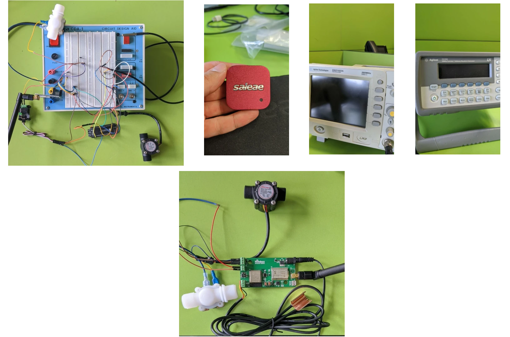
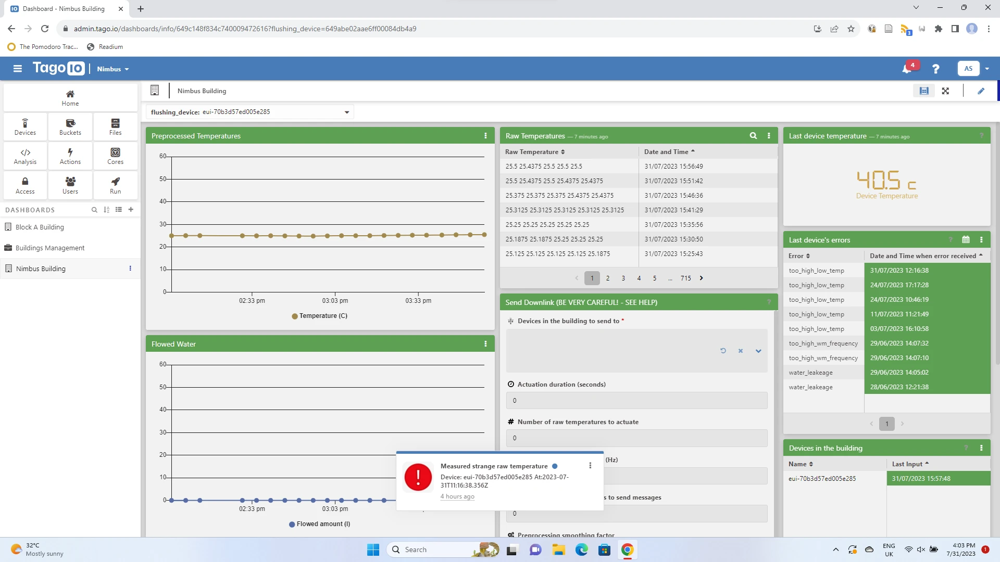
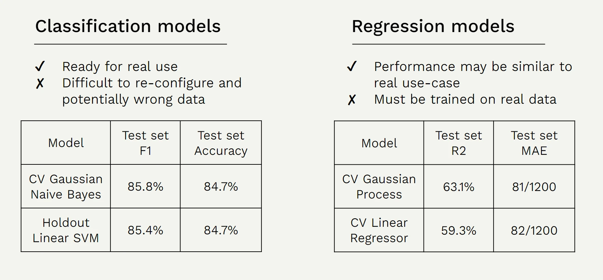
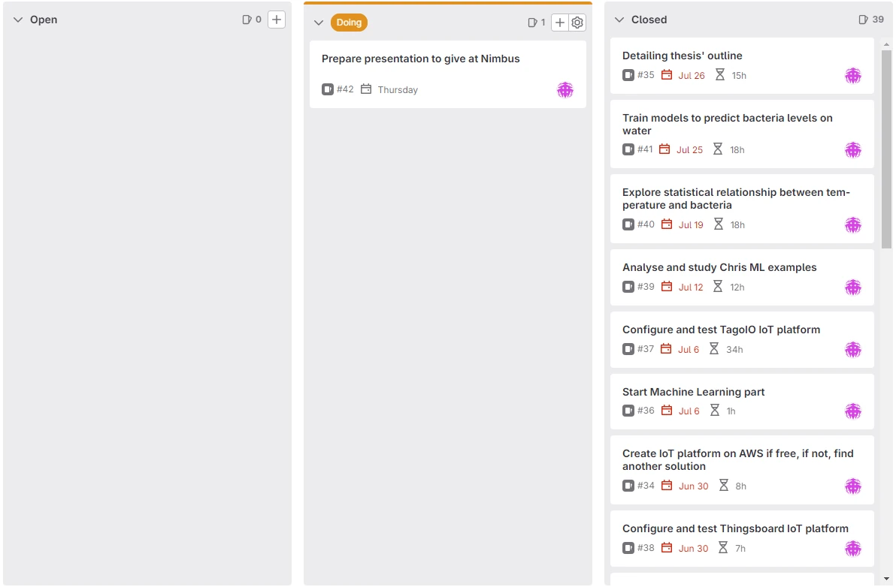

# IoT wastewater management system

My master's thesis focused on an **IoT system** for wastewater management in public buildings, in order to reduce bacterial concentrations and associated risks. In addition to automating the flushing process, I've also integrated **machine learning models** to enable smarter water consumption and increased bacterial reduction. The project was a proof of concept requested by an external client and will also be the subject of a paper.

## Main tasks:

- **IoT devices development:** validated the hardware of the devices based on the ESP-32 microcontroller, also using AWG and oscilloscope for testing. Developed the firmware in C that interacts with the device's components via the UART and 1-Wire protocols. As one of the modules became unresponsive under certain conditions, studied its behaviour with a logic analyzer.

- **IoT platforms setup:** integrated LoRa and LoRaWAN on the devices using The Things Stack server. Configured an IoT platform with dashboards, notifications and data retrieval functionalities, using Python and JavaScript.

- **Machine learning models development:** developed models with Python and the Scikit-learn library to predict bacterial levels in wastewaters using only the temperature data point. The data used was retrieved from open source datasets, for the sake of testing this approach.

- **Project management:** used GitLab for versioning and documenting.

Unfortunately, I cannot provide the source code of the project, as it will be used for commercial reasons.